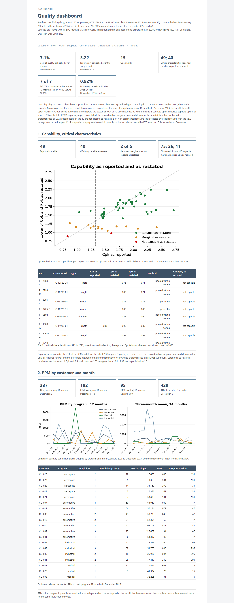

# mfg-quality-engineering

Measurement systems, capability, root cause, acceptance sampling, a designed experiment and cost of quality on a precision machining shop, January 2024 to December 2025, computed on the shop's complete quality record and set beside the figures the shop reports.



## What is included

- Six connected studies, each delivered as a client report, with an A3 for each improvement project: gauge R&R, bias, linearity and attribute agreement; process capability restated on every subgroup; root cause of scrap on one part family; acceptance sampling and the supplier scorecard; a designed experiment on surface finish; cost of quality reconciled to its source tables. Each study is mapped to the PPAP element or AS9102 form it supports.
- One quality dashboard: capability as reported beside capability as restated, PPM by program, NCRs by cause and detection point, the supplier scorecard with intervals, cost of quality by category, gauge calibration status, SPC alarms.
- A data pipeline from raw system exports to analysis-ready marts: DuckDB, dbt with schema tests, one build command that regenerates every table, figure and page byte-identically.

## Business context

The shop is a precision machining supplier: about 150 employees, IATF 16949 and AS9100, one plant, about 600 active part numbers across 40 families on Swiss, multi-axis turning, milling and grinding, for automotive, aerospace, medical and industrial programs. Critical characteristics run on SPC in the QMS module; CMM reports, receiving inspection, NCRs, complaints and calibration each live in their own system; accounting books quality cost on its own lines.

The shop's quality reporting rested on three documents: the monthly scrap report, the capability reports its engineers file with customer packages from the last 25 subgroups, and a quarterly supplier scorecard ranked on lot acceptance. In 2025 those documents said that 49 of the 56 critical characteristics with a report were capable, that one machine accounted for most of the scrap on the F-14 family, that the plating supplier S-017 was accepted at receiving on every lot while its defects reached customers as complaints, and that quality cost the shop about $560,000 a year. The engineering staff ran the studies the customers required, on worksheets, in a statistics package; the two years of SPC subgroups, CMM reports, receiving results and NCRs behind those worksheets were used for nothing beyond the control charts that produced them.

The engagement computed each of those figures again on the whole record and compared the two: the gauge studies against the production history on the same bore, the 25-subgroup capability reports against every 2025 subgroup, the machine Pareto against a model that controls for bar-lot hardness and insert grade, the receiving plan against the supplier's actual lot quality, the scrap report against every failure line in the ledger. Where the shop's figure held, the report says so; where it did not, the report gives the restated figure, the reason, and what to do. The studies below are the result, in the order they were built.

## Studies

| Study | Question | Finding | PPAP or AS9102 element | Deliverable |
|---|---|---|---|---|
| S1. Measurement system analysis | How much of the tolerance on the critical bore do the gauges consume? | The bore gauge consumes 34.0% of tolerance (ndc 2) and the air gauge 7.2% (ndc 10); 30% of the apparent process variation on the bore in 2025 was measurement; the production history gives an operator sd of 0.0031 mm over 8 machinists against the study's 0.0024; bore-gauge bias against the CMM on 703 matched pieces is 0.0006 mm (0.0004 to 0.0009). | PPAP element 7, measurement system analysis studies; AS9102 supporting data | [report](https://brimsystems.github.io/mfg-quality-engineering/docs/reports/s1_msa.html) |
| S2. Process capability | Are the characteristics the shop reports as capable capable? | Of 49 critical characteristics the shop reports as capable, 9 are not when the calculation uses the pooled within-subgroup standard deviation, the fitted distribution for bounded characteristics and all 2025 subgroups; 2 of 5 reported as marginal are capable; the reported values carry a sampling interval of ±0.20 to ±0.38 at 25 subgroups and 14 of the capable calls lie inside it; the medical bore gives Cpk 2.21 on the shop's 25 readings, 1.89 on the year's subgroups and 1.82 on every piece. | PPAP element 10, initial process studies; AS9102 Form 3 supporting data | [report](https://brimsystems.github.io/mfg-quality-engineering/docs/reports/s2_capability.html) |
| S3. Root cause of scrap on family F-14 | What drives scrap on family F-14? | MT-04 accounted for 43% of scrap on the family; controlling for bar-lot hardness and insert grade the machine effect is not significant (p = 0.74); hardness above 32 HRC with the standard insert explains 69.4% of the between-lot scrap variance; the insert change cut the family's scrap rate from 3.55% to 0.87% on the next 25 lots (p < 0.001) and 0.92% on all 36 since, with the control family unchanged. | Corrective action record; DMAIC project with A3 | [report](https://brimsystems.github.io/mfg-quality-engineering/docs/reports/s3_root_cause.html), [A3](https://brimsystems.github.io/mfg-quality-engineering/docs/a3/s3_root_cause.html) |
| S4. Acceptance sampling and supplier quality | What does the receiving plan protect against, and which suppliers run above 1%? | The c=0 plan gives the same consumer protection at the LTPD as the current plan (6.6% against 6.5% on lots of 501 to 1,200) at 38% of the sample pieces and rejects 72 of 194 S-017 lots over 24 months against the current plan's 26; the Z1.4 switching rules, never applied in the record, would have moved 47 of 60 suppliers to reduced inspection and saved 2,298 receiving hours; evaluated on S-017's lot history the current plan accepts 47% of lots above 2.5% defective and the c=0 plan 29%; 4 of 60 suppliers have defect-rate intervals lying entirely above 1%; 2 of the five worst suppliers on the published scorecard have fewer than five lots. | PPAP element 15 supporting data for purchased product; supplier control | [report](https://brimsystems.github.io/mfg-quality-engineering/docs/reports/s4_sampling.html) |
| S5. Designed experiment on surface finish | Which settings bring the surface finish inside its limit? | Feed and insert nose radius interact (effect -0.405 µm, p < 0.001); at 0.8 mm radius the feed effect reverses (+0.59 µm at 0.4 mm, -0.22 µm at 0.8 mm); the chosen settings reduce Ra from 1.40 to 0.76 µm, confirmed on four runs inside the prediction interval (0.61 to 0.91); the next 11 production lots hold 0.70 µm. | PPAP element 11 supporting data; DMAIC project with A3 | [report](https://brimsystems.github.io/mfg-quality-engineering/docs/reports/s5_doe.html), [A3](https://brimsystems.github.io/mfg-quality-engineering/docs/a3/s5_doe.html) |
| S6. Cost of quality | What does quality cost beyond the scrap report? | Cost of quality is 7.1% of 2025 revenue as booked and 7.6% with rework left on production jobs estimated; failure costs are 3.22 times the scrap report as booked; prevention is 6.1% of the booked total; the non-capable length, the F-14 scrap and the plating escapes account for 6.4% of failure cost. | Management summary; DMAIC project with A3 | [report](https://brimsystems.github.io/mfg-quality-engineering/docs/reports/s6_cost_of_quality.html), [A3](https://brimsystems.github.io/mfg-quality-engineering/docs/a3/s6_cost_of_quality.html) |

| Study | PPAP or AS9102 element | Deliverable |
|---|---|---|
| S1. Measurement system analysis | PPAP element 7, measurement system analysis studies; AS9102 supporting data | [report](https://brimsystems.github.io/mfg-quality-engineering/docs/reports/s1_msa.html) |
| S2. Process capability | PPAP element 10, initial process studies; AS9102 Form 3 supporting data | [report](https://brimsystems.github.io/mfg-quality-engineering/docs/reports/s2_capability.html) |
| S3. Root cause of scrap on family F-14 | Corrective action record; DMAIC project with A3 | [report](https://brimsystems.github.io/mfg-quality-engineering/docs/reports/s3_root_cause.html), [A3](https://brimsystems.github.io/mfg-quality-engineering/docs/a3/s3_root_cause.html) |
| S4. Acceptance sampling and supplier quality | PPAP element 15 supporting data for purchased product; supplier control | [report](https://brimsystems.github.io/mfg-quality-engineering/docs/reports/s4_sampling.html) |
| S5. Designed experiment on surface finish | PPAP element 11 supporting data; DMAIC project with A3 | [report](https://brimsystems.github.io/mfg-quality-engineering/docs/reports/s5_doe.html), [A3](https://brimsystems.github.io/mfg-quality-engineering/docs/a3/s5_doe.html) |
| S6. Cost of quality | Management summary; DMAIC project with A3 | [report](https://brimsystems.github.io/mfg-quality-engineering/docs/reports/s6_cost_of_quality.html), [A3](https://brimsystems.github.io/mfg-quality-engineering/docs/a3/s6_cost_of_quality.html) |

**Dashboard.** [docs/dashboard/index.html](https://brimsystems.github.io/mfg-quality-engineering/docs/dashboard/index.html). Index of deliverables: [docs/index.html](https://brimsystems.github.io/mfg-quality-engineering/docs/index.html). December 2025 is the current month and the week of 15 December the current week; every panel carries a one-line definition in the reports' wording.

## Methods

Quality engineering statistics: gauge R&R by the AIAG ANOVA method with variance components, % of tolerance and ndc; bias and linearity from calibration records; attribute agreement with Fleiss' kappa; stability by Western Electric rules 1 to 4 before capability; Cp, Cpk, Pp and Ppk with bootstrap intervals; distribution fitting by Anderson-Darling and the percentile method for bounded characteristics; the sampling interval a 25-subgroup study carries; ANOVA and quasi-likelihood binomial regression with controls for root cause; two-proportion score tests with a control family; Z1.4 and zero-acceptance sampling plans on binomial and hypergeometric OC curves, AOQ and switching rules, evaluated against the supplier's actual lot-quality distribution; Jeffreys intervals on supplier rates; a 2^(4-1) designed experiment with alias resolution, a reduced model, prediction intervals and confirmation runs; cost of quality assembled from cost lines and reconciled line by line to the source tables.

Data engineering: raw system exports loaded to DuckDB; a dbt project with schema tests on every mart (249 nodes and tests); one build command that regenerates every table, figure and page byte-identically from the committed inputs; two executions from a clean tree give byte-identical outputs.

Population against sample: every study computes the shop's own figure on its own sample first and then the same quantity on all records, in one table, so the difference is measured rather than asserted.

Framing: the improvement projects are written as DMAIC projects with an A3 each. Every report describes the findings and what to do, in the form a client receives at the end of an engagement.

## Data

Every figure in the studies is computed on all records in the period: 2,691 lots, 132,461 subgroups of five and 63,872 single-piece records (726,177 readings), 24,065 CMM reports, 5,031 receiving lots, January 2024 to December 2025; the gauge, attribute and designed-experiment studies are the shop's worksheets as recorded.

The record carries what these systems carry in practice: digit preference and readings pulled inside a limit on hand gauges, subgroups entered in a batch at the end of a shift, gauge ids not updated after a gauge went out of service, CMM feature names that do not match the characteristics master, NCR cause codes as the opener entered them, receiving samples below the table value, duplicated complaint entries, and rework hours left on the production job. The analyses work with the record as it stands and say so where it limits a finding.

Export batch 20260106T061500Z-QE24M, as at 31 December 2025.

| System | Export | Grain | Records |
|---|---|---|---|
| ERP | data/raw/erp/customers.csv | customer | 45 |
| ERP | data/raw/erp/employees.csv | employee | 70 |
| ERP | data/raw/erp/jobs.csv | lot | 2,691 |
| ERP | data/raw/erp/machines.csv | machine | 24 |
| ERP | data/raw/erp/material_certs.csv | bar lot | 1,256 |
| ERP | data/raw/erp/parts.csv | part | 600 |
| ERP | data/raw/erp/routings.csv | part and operation | 2,841 |
| ERP | data/raw/erp/scrap_transactions.csv | scrap transaction | 4,663 |
| QMS with SPC module | data/raw/qms/audit_findings.csv | audit finding | 90 |
| QMS with SPC module | data/raw/qms/capa.csv | corrective action | 60 |
| QMS with SPC module | data/raw/qms/capability_reports.csv | capability report | 874 |
| QMS with SPC module | data/raw/qms/characteristics.csv | part and characteristic | 2,400 |
| QMS with SPC module | data/raw/qms/complaints.csv | complaint | 84 |
| QMS with SPC module | data/raw/qms/final_inspection.csv | lot | 2,615 |
| QMS with SPC module | data/raw/qms/ncrs.csv | nonconformance | 779 |
| QMS with SPC module | data/raw/qms/receiving_inspection.csv | receiving lot | 5,031 |
| QMS with SPC module | data/raw/qms/spc_subgroups.csv | subgroup | 196,333 |
| QMS with SPC module | data/raw/qms/suppliers.csv | supplier | 60 |
| CMM and vision software | data/raw/cmm/cmm_features.csv | report and feature | 297,675 |
| CMM and vision software | data/raw/cmm/cmm_reports.csv | CMM report | 24,065 |
| Calibration system | data/raw/calibration/calibrations.csv | calibration event | 1,621 |
| Calibration system | data/raw/calibration/gauges.csv | gauge | 300 |
| Accounting | data/raw/accounting/cost_of_quality_lines.csv | cost line | 2,147 |
| Accounting | data/raw/accounting/labor_rates.csv | role and year | 8 |
| Study worksheets | data/raw/studies/attribute_agreement_cosmetic.csv | inspector, part and trial | 300 |
| Study worksheets | data/raw/studies/doe_surface_finish.csv | run | 20 |
| Study worksheets | data/raw/studies/gauge_rr_air_gauge.csv | operator, part and trial | 90 |
| Study worksheets | data/raw/studies/gauge_rr_bore_gauge.csv | operator, part and trial | 90 |

`pipeline/load` loads the CSV exports under `data/raw` into DuckDB with dlt, one table per file. The dbt project under `pipeline/dbt` builds the staging models (one per export, typed), the intermediate models (the process history of each characteristic with lot, machine, operator, gauge, bar lot and calibration status; the CMM feature mapping and the serial match; lot outcomes; receiving outcomes with the Z1.4 table values; cost lines with their source records) and the marts, with schema tests on keys, ranges and relationships in every layer. The scripts under `analytics/` read the marts and the study worksheets under `data/raw/studies` and write each study's report, A3 and figures under `docs/`, the dashboard and this file.

## How to run

Python 3.12 or later, from a clean clone:

```
python -m venv .venv
.venv\Scripts\activate            # Windows; on Linux or macOS: source .venv/bin/activate
pip install -e .
python -m pipeline.load.load_exports
cd pipeline/dbt
dbt build --profiles-dir .
cd ../..
python -m analytics.build_all
```

## Author

Brian Davis. Data engineering and applied analytics/ML for manufacturers. Other work: [github.com/brimsystems](https://github.com/brimsystems?tab=repositories).
